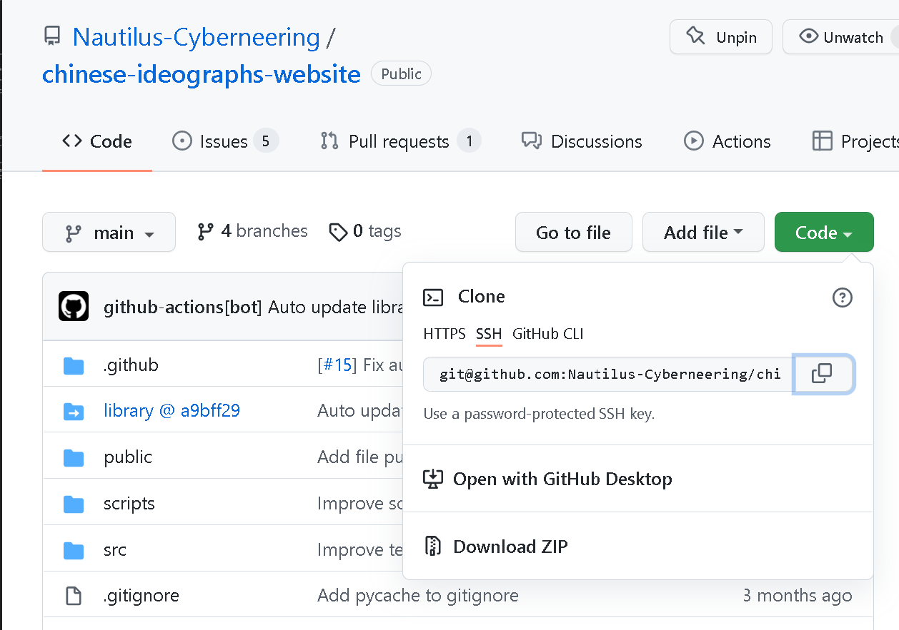

# Git & GitHub How To

This is an starter point for anyone new to using Git and GitHub.
Here you will find the following information:

**For Git:** - [Go to section](#git)

- An explanation as to what is Git?
- Some basic Git commands
- Links to helpful blog posts, online guides

**For GitHub:** - [Go to section](#github)

- An explanation as to what is GitHub?
- Links to helpful blog posts, online guides
- Some advice on best practices

**For GIT - Visual User interfaces:** - [Go to section](#git---visual-user-interfaces)

Links to two visual user interface applications:

- [GitHub Desktop](#github-desktop-app)  
        Very basic easy to use user interface built by GitHub.
        Can through errors since it does not provide good support for repositories with GitHub submodules as of 2022-02-21.

- [GitKraken](#gitkraken-desktop-app)  
        Complete solution with all bells and whistles, from GPG, SSH key creation, to in app pull requests, etc. Comes in three versions: Free, Pro, Enterprise.
        The Free versions works with public online or locally hosted repositories.

## Git

---

### What is Git?

Wikipedia.org Definition:

>"Git (/ɡɪt/) is software for tracking changes in any set of files, usually used for coordinating work among programmers collaboratively developing source code during software development. Its goals include speed, data integrity, and support for distributed, non-linear workflows (thousands of parallel branches running on different systems)."

Essentially it is a software that helps track and coordinate software development among developers.

Here are some good videos that explain the what and how of Git:

- Introduction to Git - Core Concepts - <https://www.youtube.com/watch?v=uR6G2v_WsRA>
- Git Workflow - <https://www.youtube.com/watch?v=3a2x1iJFJWc>

### Git Basic Commands

#### Cloning Repositories

>git clone <git_repository ssh url>

In order to get the git repository ssh url you have to go to the repository, and select the green "Code" button, and here choose the "ssh" tab to then copy the url as shown in the following image:

You have to click on "Code" and then select "SSH" and copy the address which whould look something similar to this:

>git@github.com:Nautilus-Cyberneering/chinese-ideographs-website.git

**Important Note:

Before doing this step you might have to set up your git installation with OPENSSH.
If you are running Windows you will have to activate the OPENSSH service and then generate a new SSH-Key for yourself and copy it into your GitHub profile security settings to do so here are some useful links:

- Setting Up SSH with GIT on Windows - <https://dev.to/bdbch/setting-up-ssh-and-git-on-windows-10-2khk>
- How do I show my local GIT configuration - <https://stackoverflow.com/questions/12254076/how-do-i-show-my-global-git-configuration>

More on the "git clone":
<https://www.git-scm.com/docs/git-clone>

#### Listing Branches

- Locally:

      git branch

- Remote:

      git branch -r

- All branches remote and local:

      git branch -a

    Note: A good habit is to update your remote repositories information to make sure that you see all the remote repositories. You can do this using the following command:

        git fetch   

#### Switching Branches

- Local

        git switch [branch_label]

- Remote

        git checkout 

#### Deleting

- Local Branches

        git branch -d [branch_label]

- Remote Branches

        git push remote_name -d remote_branch_name

#### Updating a remote branch through a commit

- git commit -a

### Git - Helpful Links

**Awesome Lists:**

- <https://github.com/sindresorhus/awesome#development-environment>

**Cheatsheets:**

- Official - <https://git-scm.com/docs>
- Git Cheat Sheet – 50 Git Commands You Should Know - <https://www.freecodecamp.org/news/git-cheat-sheet/>
- GitHub Git Cheat Sheet - <https://training.github.com/downloads/github-git-cheat-sheet.pdf>

#### Git Online Tutorials

**Written:**

- Official Documentation - <https://git-scm.com/docs/gittutorial>
- Git Handbook - by GitHub - <https://docs.github.com/en/get-started/using-git/about-git>
- Good general use online tutorial - <https://www.w3schools.com/git/default.asp>
- Git tutorial in Spanish - <https://www.ionos.es/digitalguide/paginas-web/desarrollo-web/tutorial-de-git/>
- The beginner’s guide to Git & GitHub - <https://www.freecodecamp.org/news/the-beginners-guide-to-git-github/>
- Learn the Basics of Git in Under 10 Minutes - <https://www.freecodecamp.org/news/learn-the-basics-of-git-in-under-10-minutes-da548267cc91/>

- Git on Windows - <https://adamtheautomator.com/git-bash/>
- Git on Linux - <https://www.tutorialspoint.com/git/git_environment.htm>
- Git on Mac - <https://phoenixnap.com/kb/install-git-on-mac>
- Git and GitHub Beginner Tutorial 2 - MAC - Getting started - Install Git (mac) - <https://www.youtube.com/watch?v=0Icla6TVNNo>

**Videos:**

- What is Git? - <https://www.youtube.com/watch?v=2ReR1YJrNOM>
- Git and GitHub for Beginners Crashcourse - <https://www.youtube.com/watch?v=RGOj5yH7evk>
- Git Tutorial for Beginners: Command Line Basics - <https://www.youtube.com/watch?v=HVsySz-h9r4>
- Git Tuorial for Beginners - SPANISH - <https://www.youtube.com/watch?v=kEPF-MWGq1w>
- Git and GitHub - Practical Course from Scratch - SPANISH - <https://www.youtube.com/watch?v=HiXLkL42tMU>

### Git - Best Practices

- After merging deleting merged branches locally and remotely

#### Branch Cleaning

## GitHub

---

What is GitHub - <https://www.youtube.com/watch?v=w3jLJU7DT5E>

### GitHub - Helpful Links

**Awesome Lists:**

- Awesome GitHub List - <https://project-awesome.org/phillipadsmith/awesome-github>

**Written:**

- GitHub official tutorials - <https://docs.github.com/en/get-started/quickstart/hello-world>

**Videos:**

- GitHub Youtube Channel - <https://www.youtube.com/channel/UC7c3Kb6jYCRj4JOHHZTxKsQ>
- Training • GitHub and Git Foundations - <https://www.youtube.com/watch?v=HwrPhOp6-aM&list=PL0lo9MOBetEHhfG9vJzVCTiDYcbhAiEqL>
- Git & GitHub Crash Course For Beginners - <https://www.youtube.com/watch?v=SWYqp7iY_Tc>
- Git and GitHub for Beginners Crashcourse - <https://www.youtube.com/watch?v=RGOj5yH7evk>
- Git and GitHub - Practical Course from Scratch - SPANISH - <https://www.youtube.com/watch?v=HiXLkL42tMU>
- Git and GitHub Beginner Tutorial 2 - MAC - Getting started - Install Git (mac) - <https://www.youtube.com/watch?v=0Icla6TVNNo>

### GitHub - Best Practices

- Advanced overview of GitHub best practices - <https://resources.github.com/videos/github-best-practices/>
- Top 10 GitHub best practices for developers - <https://medium.com/datreeio/top-10-github-best-practices-for-developers-d6309a613227>

## GIT - Visual User Interfaces

---

### GitHub Desktop App

Download: <https://desktop.github.com/>

Tutorials: <https://docs.github.com/en/desktop/installing-and-configuring-github-desktop/overview/getting-started-with-github-desktop>

**Videos:**

- How to use GitHub Desktop: The easy tutorial(Part1) - <https://www.youtube.com/watch?v=RPagOAUx2SQ>
- How to use GitHub Desktop: The easy tutorial(Part2) - <https://www.youtube.com/watch?v=GOY9wMyr7pU>
- GitHub Desktop Quick Intro For Windows - <https://www.youtube.com/watch?v=77W2JSL7-r8>

- GITHUB DESKTOP DE ESCRITORIO: ¿COMO USAR? CREAR REPOSITORIOS, COMMIT Y PULL | LO BÁSICO - SPANISH - <https://www.youtube.com/watch?v=UISDyE9KMlI>
- Github Desktop Tutorial - Interfaz Grafica Oficial de Github - SPANISH - <https://www.youtube.com/watch?v=TuOQBfhp-r0>

### GitKraken Desktop App

Download: <https://www.gitkraken.com/>

Tutorials: <https://www.gitkraken.com/learn/git>

**Videos:**

- GitKraken Youtube Channel <https://www.youtube.com/c/Gitkraken>
