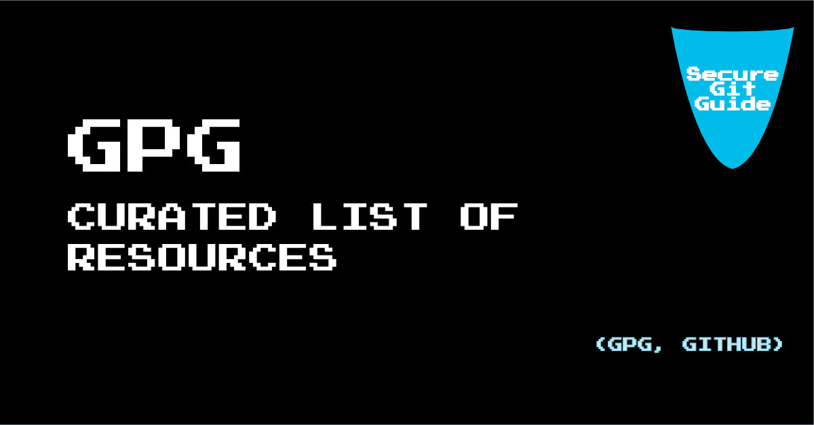

# Curated List of Resources

Index:

- [GPG](#gpg)
- [Git](#git)
- [GitHub](#github)

---

## GPG

---

### Downloads & Installation (GPG)

- <https://gnupg.org/>
- <https://gpg4win.org/>
- <https://linuxhint.com/gpg-command-ubuntu/>

### Uses (GPG)

- Git -- <https://docs.github.com/en/authentication/managing-commit-signature-verification/signing-commits>
- GitHub -- <https://git-scm.com/book/en/v2/Git-Tools-Signing-Your-Work>
- Email and other uses -- <https://www.openpgp.org/>
- Various -- <https://gnupg.org/software/frontends.html>

### Best Practices (GPG)

- <https://github.com/josecelano/pygithub/blob/main/docs/how_to_create_a_subkey_for_signing.md>

### Definition (GPG)

- <https://en.wikipedia.org/wiki/GNU_Privacy_Guard>

### Good Articles (GPG)

- <https://blog.ghostinthemachines.com/2015/03/01/how-to-use-gpg-command-line/>

---

## Git

---

### Downloads & Installation (Git)

- Official Site - <https://git-scm.com/downloads>

### Best Practices (Git)

- [7 Git Best Practices to Start using in your next Commit](https://sourcelevel.io/blog/7-git-best-practices-to-start-using-in-your-next-commit)
- [Security best practices for git users](https://resources.infosecinstitute.com/topic/security-best-practices-for-git-users/)

### Definition (Git)

- <https://en.wikipedia.org/wiki/Git>

### Great Resource (Git)

- [Git Magic Resource](http://www-cs-students.stanford.edu/~blynn/gitmagic/) (Very extensive and documented)  covers Git to some extent and focuses GitHub
- [Awesome List of resources for Git and Github](https://project-awesome.org/phillipadsmith/awesome-github)

### Books (Git)

- [Official Git Pro eBook (free)](https://git-scm.com/book/en/v2)
- [Git](https://www.amazon.com/-/en/Richard-Silverman/dp/1449325866/ref=sr_1_25?__mk_es_US=%C3%85M%C3%85%C5%BD%C3%95%C3%91&crid=WONZH23LUI7&keywords=github&qid=1655454291&sprefix=githu%2Caps%2C192&sr=8-25)

---

## GitHub

---

### Downloads & Installation (GitHub)

GitHub is an online platform service so that in essence you do not need to install anything to start using it.

- Official Online Site - <https://github.com/>

- [GitHub Documentation](https://docs.github.com/en)

### Best Practices (GitHub)

- Good starter - [GitHub Best Practices (NC State)](https://docs.github.ncsu.edu/github-best-practices/)

- [10 GitHub Best Practices](https://medium.com/datreeio/top-10-github-best-practices-for-developers-d6309a613227)

- Some important concepts - [Best Practices for GitHub Repositories](https://www.codecademy.com/learn/paths/web-development/tracks/learn-git/modules/best-practices-for-teams-on-github/cheatsheet)

### Definition (GitHub)

- <https://en.wikipedia.org/wiki/GitHub>

### Great Resource (GitHub)

- [Git Magic Resource](http://www-cs-students.stanford.edu/~blynn/gitmagic/) (Very extensive and documented)  covers Git to some extent and focuses GitHub
- [Awesome List of resources for Git and Github](https://project-awesome.org/phillipadsmith/awesome-github)

### Books

- [Git Essentials](https://www.amazon.com/GitHub-Essentials-collaborative-development-workflows/dp/1789138337/ref=sr_1_19?__mk_es_US=%C3%85M%C3%85%C5%BD%C3%95%C3%91&crid=WONZH23LUI7&keywords=github&qid=1655454439&sprefix=githu%2Caps%2C192&sr=8-19)

[Back to home](./index.md)
