# GPG - 101 - How to get your first GPG Keys


## Installing GPG

The steps to install GPG on your computer are the following:

1. Download the necessary software for your Operating System at:
    - [Windows](https://gpg4win.org/download.html)
    - [Linux - Installed through terminal](https://linuxhint.com/gpg-command-ubuntu/)
    - [Mac OS](https://sourceforge.net/p/gpgosx/docu/Download/)

## GPG4Win Kleopatra

### Generating your own new GPG Keys

---

Generating your own new GPG Keys is extremely easy.
Here is a series of screenshots of the process using the Kleopatra application for Windows.

(1)


(2)

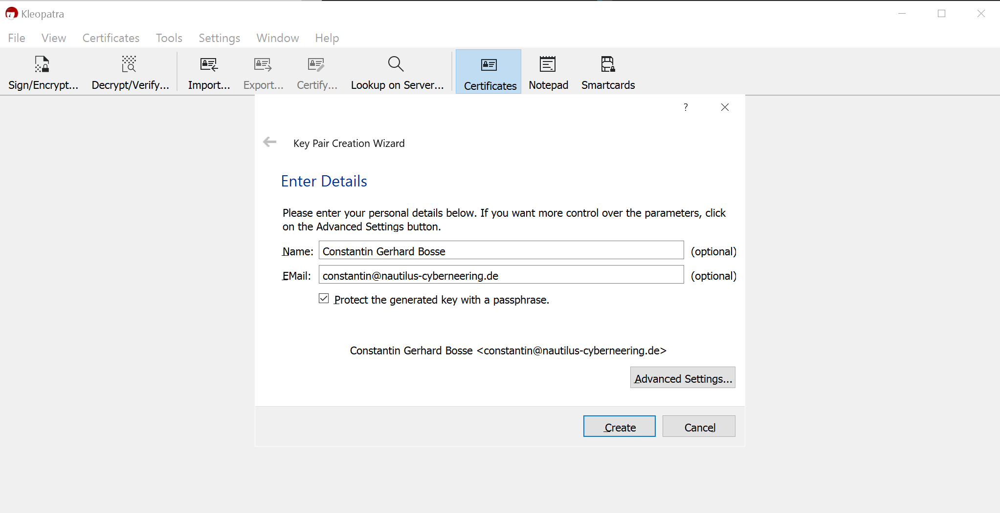

**It is extremely important to use a passphrase and more important if you use it to actually write it down somewhere so that you never loose it.**

(3)

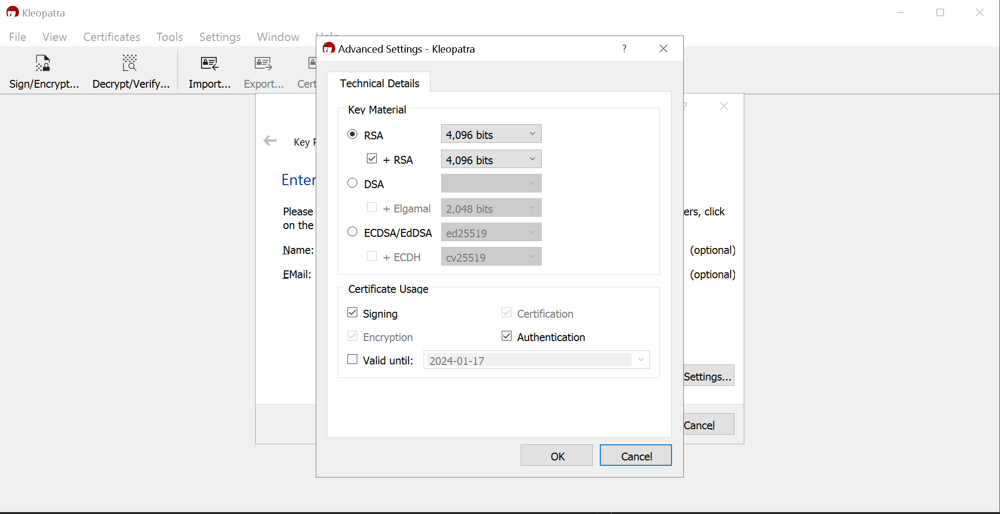

(4)


(5)

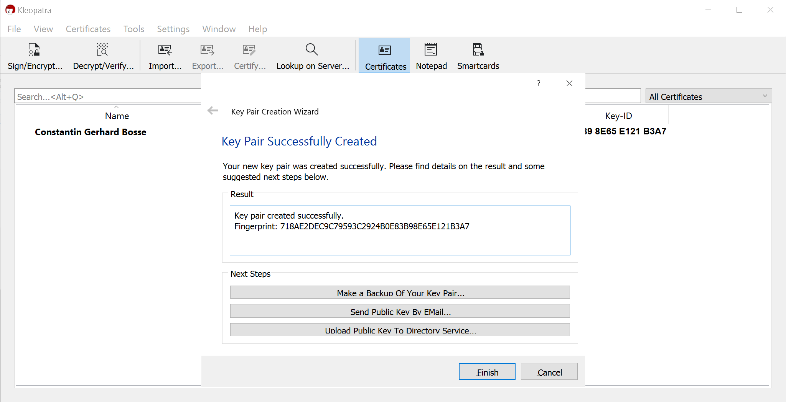

(6)

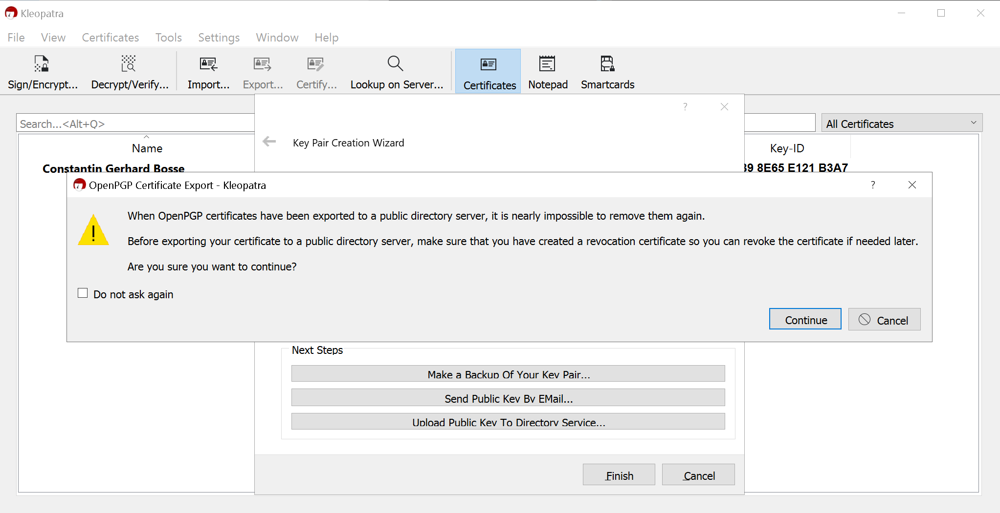

(7)


(8)


(9)

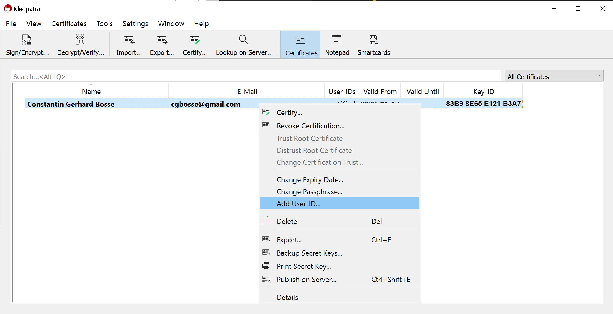

(10)


(11)


### Creating a Revocation Certificate

---
(1)


(2)


(3)


(4)


### Sample Public GPG Key

---


## Command Line or Terminal

In order to generate your new keys you have two options:

- Running the default setup.
- Running the full setup which lets you define some additional specifications such as the encryption level.

### Default Setup

---
Open the command line as an admin and type:

    ```terminal
    gpg --gen-keys
    ```

(1)


(2)

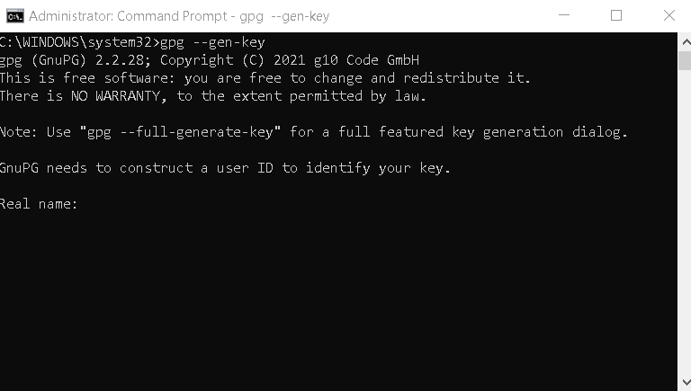

(3)


(4)


(5)


(6)


Once this has been done the keys get generated with the default encryption level of 3072.

### Full Setup

---

This option lets you:

- Define the encryption level up to 4096.
- Insert a comment.
- Define the key type (RSA, DSA, Elgamal, etc.).

It automatically generates also a revocation certificate at the default location which is indicated at the final step.

Open the command line as an admin and type:

    ```terminal
    gpg --full-generate-keys
    ```

#### Defining the key type

(1)

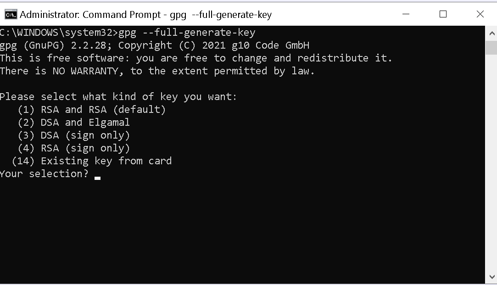

(2)

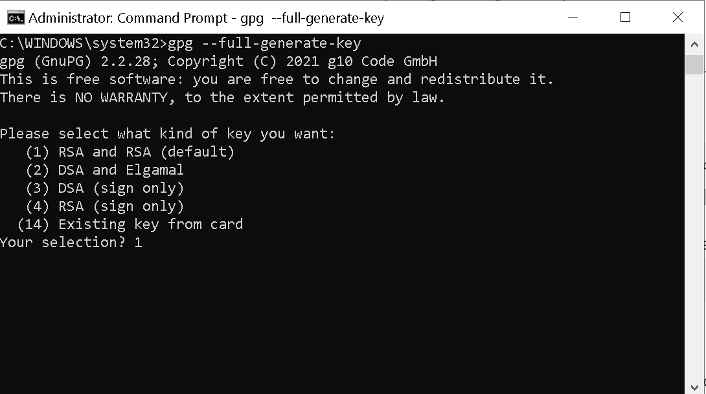

#### Defining the encryption level

(3)

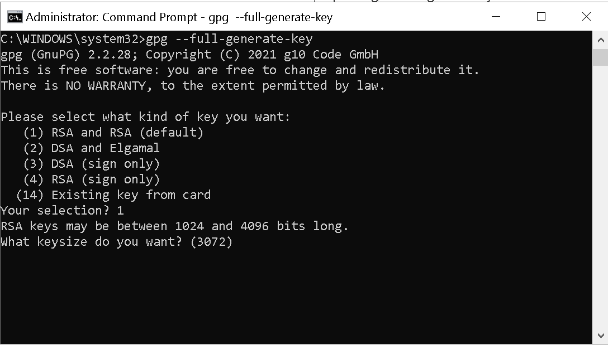

(4)

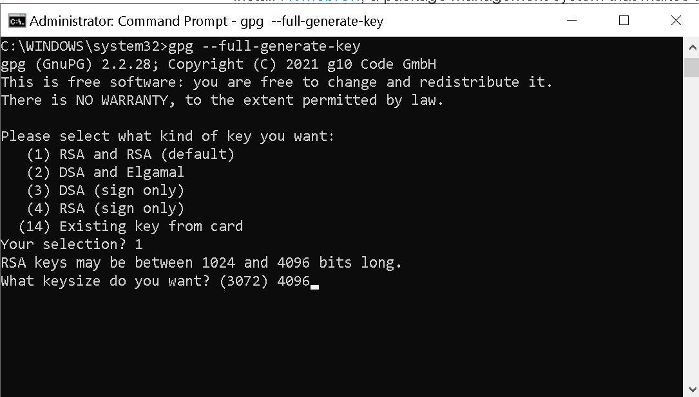

#### Defining the expiration date

(5)


(6)


(7)

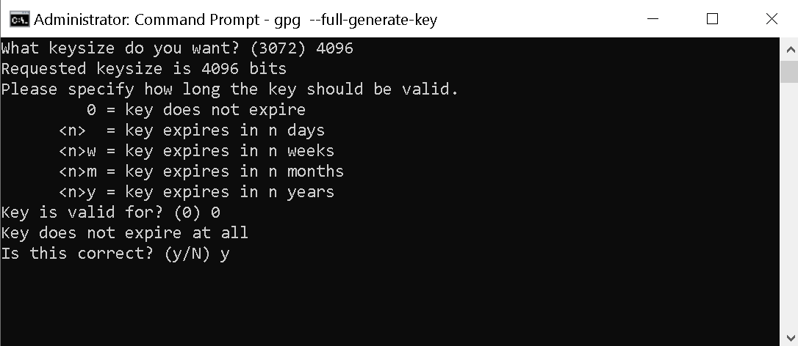

#### Defining the user ID to identify the key

(8)


(9)

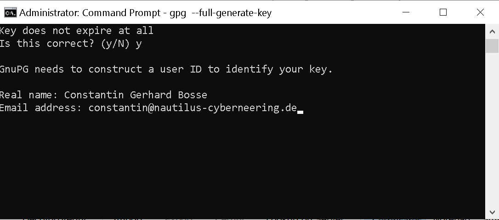

(10)


(11)

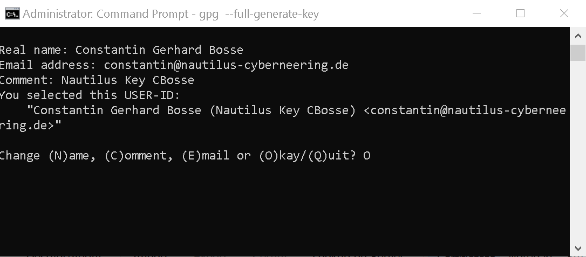

#### Final screen with revocation certificate location

(12)


[Back to home](./index.md)
