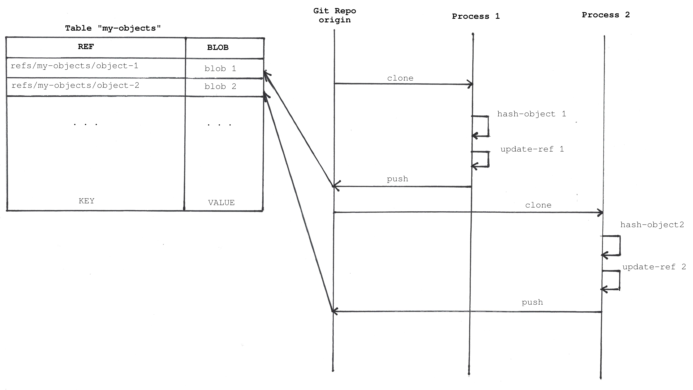

# Using Git as a key-value database

Obviously you can store whatever you want in a Git repository but in this article we will see how to use the Git internal data structures to store and retrieve data.

- [Where to store things](#where-to-store-things)
- [Using Git Objects](#using-git-objects)
- [Using Git References](#using-git-references)
- [Store only the latest state](#store-only-the-latest-state)
- [Store state change history](#store-state-change-history)
- [How to solve race conditions](#how-to-solve-race-conditions)
  - [Optimistic concurrency control](#optimistic-concurrency-control)
  - [Atomic Git push](#atomic-git-push)
- [GitHub Git database](#github-git-database)
- [Links](#links)
  - [Projects using Git objects and references to store data](#projects-using-git-objects-and-references-to-store-data)
  - [Talks](#talks)
  - [Articles](#articles)
  - [Books](#books)

## Where to store things?

With Git you can store data in two different ways:

- [Git objects](https://git-scm.com/book/en/v2/Git-Internals-Git-Objects)
- [References](https://git-scm.com/book/en/v2/Git-Internals-Git-References)

Those are the two ways Git stores data internally.

## Using Git Objects

Git internally uses a key-value database with only 4 [types of objects](https://git-scm.com/book/en/v2/Git-Internals-Git-Objects): `blobs`, `trees`, `commits` and `annotated tags`.

Each object is stored in the database and the way to reference the object is by using its [sha1](https://en.wikipedia.org/wiki/SHA-1) (a checksum of the content).

For example, you can insert a new object in the database with:

```s
cd /tmp
mkdir test
cd test
git init
echo 'test content' | git hash-object -w --stdin
d670460b4b4aece5915caf5c68d12f560a9fe3e4
```

The last command output is the sha1 of the new object. You can get the object content back using that sha1:

```s
git cat-file -p d670460b4b4aece5915caf5c68d12f560a9fe3e4
```

This database is immutable. You can only add new content.

If you are curious where Git stores those objects you can run this command:

<!-- spell-checker: disable -->

```s
$ tree .git/
.git/
├── branches
├── config
├── description
├── HEAD
├── hooks
│   ├── applypatch-msg.sample
│   ├── commit-msg.sample
│   ├── fsmonitor-watchman.sample
│   ├── post-update.sample
│   ├── pre-applypatch.sample
│   ├── pre-commit.sample
│   ├── pre-merge-commit.sample
│   ├── prepare-commit-msg.sample
│   ├── pre-push.sample
│   ├── pre-rebase.sample
│   ├── pre-receive.sample
│   ├── push-to-checkout.sample
│   └── update.sample
├── info
│   └── exclude
├── objects
│   ├── d6
│   │   └── 70460b4b4aece5915caf5c68d12f560a9fe3e4
│   ├── info
│   └── pack
└── refs
    ├── heads
    └── tags

10 directories, 18 files
```

<!-- spell-checker: enable -->

You can see the file `.git/objects/d6/70460b4b4aece5915caf5c68d12f560a9fe3e4`. There it is where Git stores the object.

## Using Git References

Git has a directory `.git/refs` which contains files that are the `references`. Each file contains a sha1 of a database object.

That means references are lia alias for objects. They allow you to reference objects in the database with a more readable name.

If you want to get the content from the previous example but do not want to use the sha1, you could create a reference like this:

```s
git update-ref refs/my-objects/object-1 d670460b4b4aece5915caf5c68d12f560a9fe3e4
```

The reference is a pointer or alias for the object hash you have inserted in the database before. And now you can use the reference to get the content:

```s
$ git cat-file -p refs/my-objects/object-1
test content
```

> NOTICE: we are using a custom reference name. You can use any name and path you want.

This database is a mutable database. You can change references to point to different Git objects.

You can create new references in any fork of the repository and push them to any remote repository.

There are some special references handled by Git:

```s
$ tree -al .git/refs/
.git/refs/
├── heads
├── my-objects
│   └── object-1
└── tags

3 directories, 1 file
```

Branches consist only on references pointing to the latest `commit` object hash in a sequence of commits. When you run a `git push` command Git tries to update a reference in a remote repository.

Git provides only those basic low-level databases to store things: `objects` and `references`. You can use them in different ways. We have seen at least two different models:

1. Store only the latest state.
2. Store state change history (commits).

## Store only the latest state

You can store your data inside `blob` objects. When you want to update the version of your object you can store a new object. You can use a reference to retrieve the `blob` object. You also need to prevent the [Git Garbage Collector](https://git-scm.com/docs/git-gc) from removing the object. If the `blob` object is not referenced anywhere it could be deleted.

Thi diagram shows how to different processes can write objects:



Pros:

- It is very simple. You only need to use two low level Git commits to store and retrieve your data and the very well-known porcelain commands to move data between repositories: `pull` and `push`.

Cons:

- You cannot `checkout` the reference because it does not point to a commit.

```s
$ git checkout refs/my-objects/object-1
fatal: reference is not a tree: refs/my-objects/object-1
```

- You cannot follow changes on the object because each new object version is not linked to the previous one. It is like a standard database. If you want to keep a history of your changes you can do it by yourself or use the next model.
- The model generates a lot of references since we need a reference for each object.

## Store state change history

The previous solution allows you to store objects like a key-value database. But you can take full advantage of Git by using the other available objects. When you update a `blob` object you could create a commit.

```s
cd /tmp
mkdir test
cd test
git init
git checkout --orphan "my-objects-object-1"
echo "test content" > object-1.txt
git add .
git commit --no-gpg-sign -m "add object-1.txt"
```

You can get the object with:

```s
git checkout my-objects-object-1 && cat object-1.txt 
```

But actually the object value is accessible directly just like an standard file. All you need to do is `checkout` the reference (the branch) we are using to store the object.

```s
git checkout my-objects-object-1 && cat object-1.txt
```

```s
$ tree -al .git/refs/
.git/refs/
├── heads
│   └── my-objects-object-1
└── tags
```


Pros:

- You can add metadata for every database operation in the commit message.
- You can easily get the data using the Git Porcelain commands.
- You have the history of changes for your objects.

Cons:

- It is more complex than the previous solution.
- It generates a lot of references too. One per object.

This model uses an orphan branch for each object. An "orphan" branch is a branch that is not connected to any other branch. That means the first commit does not have any ancestors.

## How to solve race conditions

We have seen two possible models to use Git to store your data as a key-value database. But does this database  implementation offer you a way to handle race conditions?

At some point, you are going to have two processes reading the same object and trying to update it at the same time. One of them is going to overwrite a previous value.

We can create an example where we have a “table” with counters.

We insert the first object with a counter starting at 0.

```s
cd /tmp
mkdir my-counters
cd my-counters/
git init
git checkout -b my-counters-counter-1
echo "0" > counter-1.txt
git add .
git commit --no-gpg-sign -m "initialize counter-1"
cat counter-1.txt
```

An independent processes could checkout the repository and increment the counter. After cloning the repository you have an old version of the data because other processes could have cloned and updated the counter.


Git is a decentralized data structure and the only way to reconciliate things is by using `pull` and `push` commands. Git will tell you when you are trying to merge data with conflicts.

### Optimistic concurrency control

We normally have two options to fix that problem with normal databases, you can either lock the record when you want to modify it (pessimistic locking) or try to modify it always and make the update fail if the record has changed (optimistic locking).

Git only allows us to use the [optimistic approach](https://en.wikipedia.org/wiki/Optimistic_concurrency_control). When you try to “push” your object version by updating the reference in the origin repo you will get an error if the reference (branch) was already changed.


We can reproduce the conflict in our previous example. We are going to `clone` the repository twice in two different folders.

```s
cd /tmp
git clone /tmp/my-counters my-counters-process-1
cd /tmp/my-counters-process-1/
git checkout my-counters-counter-1
cat counter-1.txt
```

```s
cd /tmp
git clone /tmp/my-counters my-counters-process-2
cd /tmp/my-counters-process-2/
git checkout my-counters-counter-1
cat counter-1.txt
```

The last output line should show the value `0` for the `counter-1`.

Now we can increment the counter with the first process and `push` the new value.

```s
cd /tmp/my-counters-process-1
git checkout my-counters-counter-1
echo "1" > counter-1.txt 
git add .
git commit  --no-gpg-sign -m "increment counter-1 to 1"
echo "2" > counter-1.txt 
git add .
git commit  --no-gpg-sign -m "increment counter-1 to 2"
cat counter-1.txt
```

If you try to push the counter you are going to have this error:

```s
git push origin
…
 ! [remote rejected] counter-1 -> counter-1 (branch is currently checked out)
error: failed to push some refs to '/tmp/my-counters'
```

That is because you are on the same branch in the origin repository. You only need to checkout a different branch in the origin repo.

```s
cd /tmp/my-counters
git checkout --orphan another-branch
```

Got bak to the `process-1` folder and `push` the new value.

```s
cd /tmp/my-counters-process-1/
git push origin
```

Now, the output should be like:

```s
Enumerating objects: 8, done.
Counting objects: 100% (8/8), done.
Delta compression using up to 8 threads
Compressing objects: 100% (2/2), done.
Writing objects: 100% (6/6), 482 bytes | 482.00 KiB/s, done.
Total 6 (delta 0), reused 0 (delta 0), pack-reused 0
To /tmp/my-counters
   7614015..ba3cbfb  my-counters-counter-1 -> my-counters-counter-1
```

You have updated the `origin` (our database) with a new value. Now, if you try to `push` changes from the `process-2`:

```s
cd /tmp/my-counters-process-2
git checkout my-counters-counter-1
echo "1" > counter-1.txt 
git add .
git commit  --no-gpg-sign -m "increment counter-1 to 1"
cat counter-1.txt
git push origin
```

You will get this error:

```s
To /tmp/my-counters
 ! [rejected]        my-counters-counter-1 -> my-counters-counter-1 (fetch first)
error: failed to push some refs to '/tmp/my-counters'
hint: Updates were rejected because the remote contains work that you do
hint: not have locally. This is usually caused by another repository pushing
hint: to the same ref. You may want to first integrate the remote changes
hint: (e.g., 'git pull ...') before pushing again.
hint: See the 'Note about fast-forwards' in 'git push --help' for details.
```

You cannot update the reference because the previous commits created by `process-1` would be lost.

Git does not allow you to update the object if someone else has already changed it. So basically if you use Git to store your objects the only mechanism to avoid race conditions is optimistic locking.

This way of using Git is like having an SQL table where you have version numbers for recording updates by default. That means every time you read a record you get the version number. When you update the record you check that the version number is still the same. The only difference compared with the normal SQL optimistic lock approach is that you always store the new version of the object, but you do not update the reference (pointer) to it. So you will continue retrieving the previous version.

But what would happens if you try to push a reference with `git push` outside of the branch folder? Meaning using a custom reference like the one we have used before.

The good news is that Git:

- REJECTS updating any remote reference that refers to an object not in the local git object store.
- REJECTS updating any remote reference that refers to a non-commit-object.
- REJECTS updating any remote reference that changes a commit-object into referring a non commit-object.
- REJECTS updating any remote reference that isn't a direct parent of the new-commit-object. (ie. non-fast-forward push).

It only accepts fast forward `commit` reference updates.

### How to design your unit of work

Since you only can control concurrency at the object level (references) you have to make sure that you [design your aggregates](https://www.dddcommunity.org/library/vernon_2011/) in a way that each aggregate is a different reference (or branch if you use the second model).

**What does that mean?**

In the same example, you can have strict domain rules between counters. For example:

- You cannot have more than a certain number of counters.
- All counters cannot count more than 100.

In those cases, you should have to define an object like a "pool of counters" and store all the values in the same object (branch).

If we do not have any invariant between objects you can store each object in a different orphan branch. That way you can reduce conflicts and have a better performance. On the contrary, if you have some invariants with more than one object then you have to store the whole aggregate in the same branch, so you make sure we do not have any transactional inconsistencies. You could decide the storage method depending on the invariants declared in application.

I recommend reading [these articles](https://www.dddcommunity.org/library/vernon_2011/) to know the trade-offs of aggregate design.

### Atomic Git push

Sometimes you will need to update the object but also to create other commits in others branches atomically. For example, if you want to update two objects at the same time. You could want to update both of them or neither of them. That is to say, you could want to have transactions.

Fortunately, Git has a `push` option “--atomic” that does exactly that: "Either all refs are updated, or on error, no refs are updated”.

So you could do something like:

```s
git push --atomic origin refs/heads/my-counters-counter-1 refs/heads/my-counters-counter-2 
```

More info about Atomic pushes:

- [Git 2.4 — atomic pushes, push to deploy, and more](https://github.blog/2015-04-30-git-2-4-atomic-pushes-push-to-deploy-and-more/)
- [Git push command with --atomic option](https://git-scm.com/docs/git-push#Documentation/git-push.txt---no-atomic)

## GitHub Git database

[GitHub API](https://docs.github.com/en/rest/git) allows you to access Git objects directly.

## Links

### Projects using Git objects and references to store data

- <https://graphite.dev/>
- <https://dvc.org/doc/user-guide/experiment-management/experiments-overview#how-does-dvc-track-experiments>

### Talks

- [Using Git as a NoSql Database by Kenneth Truyers](https://www.youtube.com/watch?v=nPPlyjMlQ34)
- [Git the NoSQL Database by Brandon Keepers](https://www.youtube.com/watch?v=fjN4c4RWiV0)

### Articles

- [How Git truly works](https://towardsdatascience.com/how-git-truly-works-cd9c375966f6)
- [The Biggest Misconception About Git](https://medium.com/@gohberg/the-biggest-misconception-about-git-b2f87d97ed52)

### Books

- [Git Pro - Chapter 5.3 - Maintaining a Project - Section Tagging Your Releases](https://git-scm.com/book/en/v2/Distributed-Git-Maintaining-a-Project)

[Back to home](./index.md)
